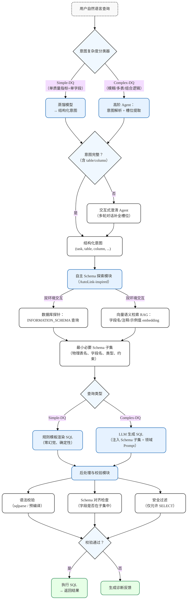

```mermaid
%%{init: {"theme": "base", "themeVariables": {"fontSize": "14px", "fontFamily": "sans-serif"}} }%%
graph TD
    %% 定义样式类（避免使用保留字）
    classDef decision fill:#f0f8ff,stroke:#333,stroke-width:1.5px,shape:diamond,rx:8,ry:8;
    classDef process fill:#ffffff,stroke:#333,stroke-width:1.5px,rx:10,ry:10;
    classDef user_io fill:#f9f9f9,stroke:#555,stroke-dasharray: 4 2,stroke-width:1.5px,rx:8,ry:8;
    classDef module fill:#e6f2ff,stroke:#1e6bb8,stroke-width:1.5px,rx:10,ry:10;
    classDef terminal fill:#e6ffe6,stroke:#2e8b57,stroke-width:1.5px,rx:10,ry:10;

    A[用户自然语言查询] --> B{意图复杂度分类器}
    class A user_io;
    class B decision;

    B -->|"Simple-DQ<br>（单质量指标+单字段）"| C1["蒸馏模型<br>→ 结构化意图"]
    B -->|"Complex-DQ<br>（模糊/多表/组合逻辑）"| C2["高阶 Agent：<br>意图解析 + 槽位提取"]
    class C1,C2 module;

    C1 --> D{"意图完整？<br>（含 table/column）"}
    C2 --> D
    class D decision;

    D -- 否 --> E["交互式澄清 Agent<br>（多轮对话补全槽位）"]
    D -- 是 --> F["结构化意图<br>(task, table, column, ...)"]
    E --> F
    class E,F process;

    F --> G["自主 Schema 探索模块<br>（AutoLink-inspired）"]
    class G module;

    G -->|"双环境交互"| G1["数据库探针：<br>INFORMATION_SCHEMA 查询"]
    G -->|"双环境交互"| G2["向量语义检索 RAG：<br>字段名/注释/示例值 embedding"]
    class G1,G2 process;

    G1 --> H["最小必要 Schema 子集<br>（物理表名、字段名、类型、约束）"]
    G2 --> H
    class H process;

    H --> I{查询类型}
    class I decision;

    I -->|"Simple-DQ"| J1["规则模板渲染 SQL<br>（零幻觉、确定性）"]
    I -->|"Complex-DQ"| J2["LLM 生成 SQL<br>（注入 Schema 子集 + 领域 Prompt）"]
    class J1,J2 module;

    J1 --> K["后处理与校验模块"]
    J2 --> K
    class K module;

    K --> K1["语法校验<br>（sqlparse / 预编译）"]
    K --> K2["Schema 对齐检查<br>（字段是否在子集中）"]
    K --> K3["安全过滤<br>（仅允许 SELECT）"]
    class K1,K2,K3 process;

    K1 --> L{校验通过？}
    K2 --> L
    K3 --> L
    class L decision;

    L -- 是 --> M["执行 SQL<br>→ 返回结果"]
    L -- 否 --> N["生成诊断反馈"]
    class M,N terminal;
```