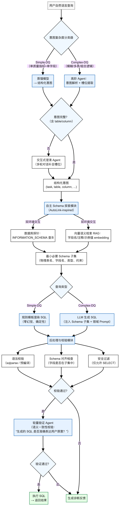
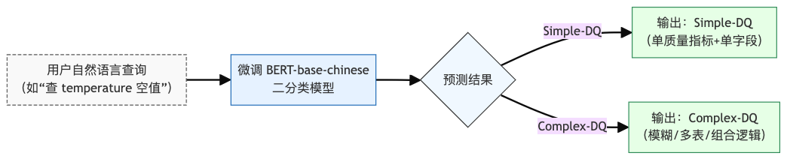
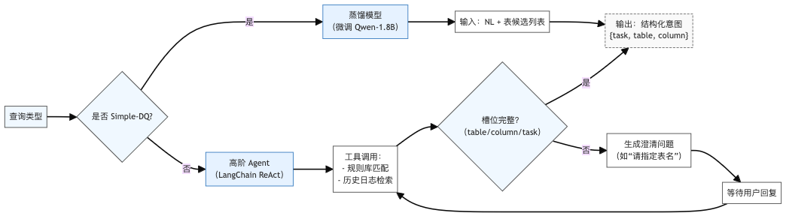
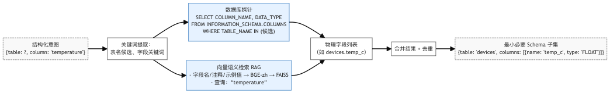
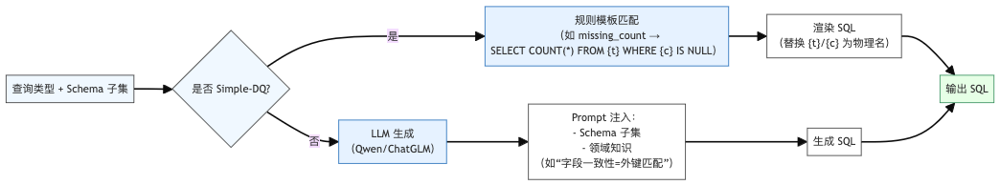
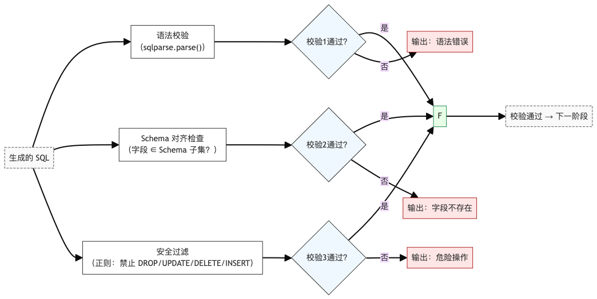
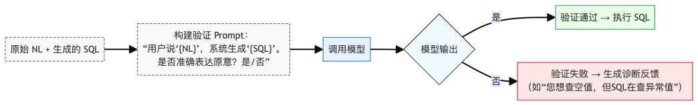

## 设计结构
采用 **六阶段流水线架构**，如图所示



---

## 核心模块详细设计

### 意图复杂度分类器

- **功能**：区分 Simple-DQ 与 Complex-DQ  
- **输入**：原始自然语言  
- **输出**：`"Simple-DQ"` 或 `"Complex-DQ"`  
- **实现**：
  - 使用 `BERT-base-chinese` 微调二分类模型
  - 训练数据：若干条人工标注样本（LLM 辅助生成 + 人工校验）
- **评估**：准确率 ≥ 90%（50 条测试集）

### 意图解析与澄清 Agent

- **Simple-DQ 路径**：
  - **蒸馏模型**：微调小模型，输入 NL + 表候选，输出结构化意图（JSON）
  - **输出示例**：`{"task": "missing_count", "table": "devices", "column": "temp"}`
- **Complex-DQ 路径**：
  - **高阶 Agent**：基于 LangChain ReAct 框架
  - **工具集**：规则库查询、历史日志检索
  - **澄清机制**：多轮对话补全缺失槽位（如表名、异常判定方式）

### 自主 Schema 探索模块（AutoLink-inspired）

- **功能**：动态构建最小必要 Schema 子集
- **双环境交互**：
  1. **数据库探针**：
     ```sql
     SELECT COLUMN_NAME, DATA_TYPE, IS_NULLABLE 
     FROM INFORMATION_SCHEMA.COLUMNS 
     WHERE TABLE_NAME = 'devices';
     ```
  2. **向量语义检索**（RAG）：
     - 向量库：字段名、注释、示例值 → BGE-zh embeddings → FAISS 索引
     - 支持模糊匹配：`"温度"` → `["temp_c", "t_val"]`
- **输出**：`{table: "devices", columns: [{"name": "temp_c", "type": "FLOAT"}]}`

### SQL 生成模块

| 路径 | 方法 | 优势 |
|------|------|------|
| **Simple-DQ** | 规则模板渲染 | 零幻觉、100% 语法正确 |
| **Complex-DQ** | LLM 生成（Qwen/ChatGLM） | 支持复杂逻辑（多表 JOIN、滑动窗口） |
- **Prompt 示例**（Complex-DQ）：
  ```
  你是一个数据质量专家。已知 devices 表有字段 temp_c(FLOAT, nullable)。
  用户请求：“找出最近7天 temperature 异常的记录，异常定义为 >100”。
  生成 SQL，仅返回 SELECT 语句。
  ```

### 后处理与校验模块

- **三层校验**：
  1. **语法校验**：`sqlparse.parse()` 
  2. **Schema 对齐**：验证 SQL 中所有字段 ∈ Schema 子集
  3. **安全过滤**：正则拦截 `DROP|UPDATE|DELETE|INSERT`
- **输出**：校验通过/失败 + 错误类型

### 轻量验证 Agent

- **功能**：语义一致性校验
- **输入**：原始 NL + 生成的 SQL
- **实现**：
  - 调用模型判断：
    > “用户说‘统计空值’，系统生成‘SELECT COUNT(*) FROM devices WHERE temp_c IS NULL’。是否一致？是/否”
- **目的**：拦截“语法正确但逻辑错误”的 SQL

## 技术选型

| 方面 | 选型 |
|--------|------|
| LLM 推理 | qwen3-max, deepseek, gpt5等 |
| 向量模型 | BGE-zh |
| 向量库 | FAISS |
| Agent 框架 | LangChain |
| GUI | Vue3 |
| 数据库连接 | SQLAlchemy + psycopg2 |

---

## 六、评估方案

### 6.1 测试集构建
- **规模**：100+ 条
- **覆盖维度**：
  - 完整性（缺失值统计）
  - 准确性（异常值识别）
  - 一致性（主外键匹配）
  - 其他常见质量问题
- **标注内容**：NL + 标准 SQL + 查询类型（Simple/Complex）

### 6.2 评估指标
| 指标 | 计算方式 |
|------|--------|
| **Exact Match (EM)** | 生成 SQL == 标准 SQL |
| **Execution Accuracy (EX)** | 执行结果 == 标准结果 |
| **幻觉率** | (含不存在字段的 SQL 数) / 总数 |
| **响应时间** | 延迟（秒） |

> 另外各个核心模块单独测试，构建测试集